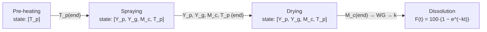
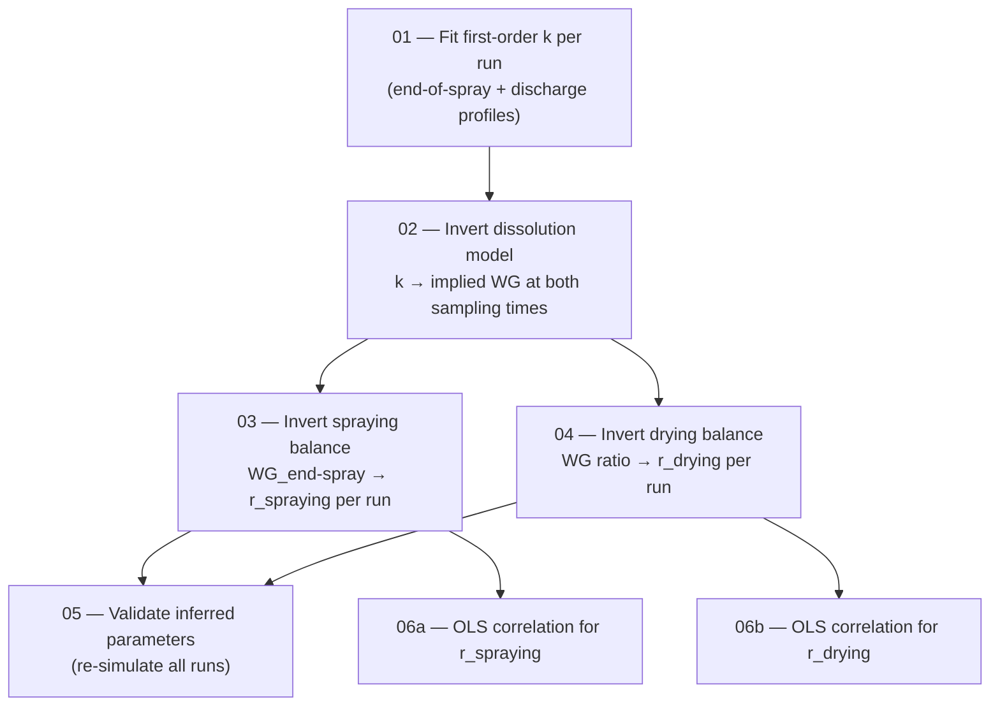

# Modelling Background — Fluid Bed Coating Digital Twin

This document explains how the digital twin of the fluid bed coating process was built: the
governing ODE systems for each process stage, the physical sub-models they share, the dissolution
model used to link coating mass to product performance, and the inverse-modelling pipeline used to
estimate the unknown coating-loss parameters from the 2018 Bosch Solidlab DoE campaign.

For installation, commands and repository layout see [README.md](README.md).

---

## Table of contents

1. [Purpose and scope](#1-purpose-and-scope)
2. [Modelling philosophy and architecture](#2-modelling-philosophy-and-architecture)
3. [Common physical sub-models](#3-common-physical-sub-models)
4. [Stage models — the ODE systems](#4-stage-models--the-ode-systems)
5. [Dissolution model](#5-dissolution-model)
6. [Parameter estimation and inverse-modelling pipeline](#6-parameter-estimation-and-inverse-modelling-pipeline)
7. [Key assumptions and known limitations](#7-key-assumptions-and-known-limitations)
8. [Nomenclature](#8-nomenclature)
9. [Code map and references](#9-code-map-and-references)

---

## 1. Purpose and scope

The digital twin predicts the thermal and mass-transfer behaviour of a fluid bed coating process in
which particles are coated with an ethylcellulose (EC) film sprayed from an acetone solution. It
simulates the three process stages run on the equipment — **pre-heating**, **spraying** and
**drying** — and chains them into a single end-to-end prediction of:

- particle and gas temperature trajectories,
- particle and gas acetone content,
- net deposited coating mass (and hence coating weight gain, WG),
- the resulting dissolution profile of the coated product.

The model is calibrated against a 20-run design of experiments (DoE) executed in 2018 on a Bosch
Solidlab coater (19 runs used; Run 20 excluded, see [Section 7](#7-key-assumptions-and-known-limitations)).
It is a *lumped*, bed-scale model: there is no CFD, no discrete-element particle tracking, and no
population balance. Its intent is fast, interpretable what-if simulation (notebooks 05a/05b and the
Streamlit app), not spatially resolved prediction.

## 2. Modelling philosophy and architecture

The twin is a **hybrid model**:

- **First-principles core** — energy and solvent mass balances on the particle bed and the gas
  phase, written as ODE systems and solved with `scipy.integrate.solve_ivp`. Heat and mass
  transfer coefficients come from the Ranz–Marshall correlation; the solvent evaporation driving
  force comes from the Antoine equation.
- **Empirical closure** — two quantities could not be derived from first principles: the coating
  lost to spray-drying during the spraying stage ($r_\mathrm{spraying}$) and the coating lost to
  attrition during the drying stage ($r_\mathrm{drying}$). These were inferred run-by-run from
  dissolution data by inverse modelling, then regressed against measurable process parameters
  (AICc-guided ordinary least squares on the DoE).

The three stages run in sequence; the end-state of each stage is the initial condition of the next:

All quantities are SI internally (m, kg, s, K, Pa, J). Stage indices follow the convention
**0 = pre-heating, 1 = spraying, 2 = drying**. Every physical constant and per-stage operating
parameter lives in a single dataclass, [`ProcessParameters`](src/fluid_bed/parameters.py), with one
instance per simulated run.

## 3. Common physical sub-models

These sub-models are shared by all stage ODEs.

### 3.1 Lumped bed and equivalent-sphere geometry

The bed is treated as $N$ identical spheres of equivalent diameter $d_\mathrm{eq}$ at a single,
uniform particle temperature $T_p$ (lumped capacitance — internal temperature gradients neglected):

$$
m_p = \rho_p \frac{\pi}{6} d_\mathrm{eq}^3,
\qquad
A_p = \pi d_\mathrm{eq}^2,
\qquad
N = \frac{M_b}{m_p}
$$

The total exchange surface is either geometric, $A_\mathrm{tot} = N A_p$, or — when a measured
specific surface area is available — SSA-based:

$$
A_\mathrm{tot} = \mathrm{SSA} \cdot M_b
$$

with SSA converted from cm²/g to m²/kg. This lets $d_\mathrm{eq}$ (used for the Reynolds number)
and the transfer surface be set independently for non-spherical particles
([parameters.py](src/fluid_bed/parameters.py)).

### 3.2 Heat and mass transfer coefficients (Ranz–Marshall)

Implemented in [transfer.py](src/fluid_bed/transfer.py). The superficial gas velocity follows from
the stage air mass flow $\dot m_\mathrm{air}$ and the bed cross-section
$A_\mathrm{bed} = \tfrac{\pi}{4} d_\mathrm{bed}^2$:

$$
u = \frac{\dot m_\mathrm{air}}{\rho_\mathrm{air} ~ A_\mathrm{bed}},
\qquad
\mathrm{Re} = \frac{\rho_\mathrm{air} ~ u ~ d_\mathrm{eq}}{\mu_\mathrm{air}}
$$

For the spraying stage (stage 1) the atomisation air flow is added to the process air flow before
computing $u$. The Nusselt and Sherwood numbers use the same Ranz–Marshall-type correlation (as
ported from the legacy MATLAB code, with a 2/5 exponent on the Prandtl/Schmidt group):

$$
\mathrm{Nu} = 2 + \mathrm{Pr}^{2/5}\left(0.43~\mathrm{Re}^{1/2} + 0.06~\mathrm{Re}^{2/3}\right),
\qquad
\mathrm{Sh} = 2 + \mathrm{Sc}^{2/5}\left(0.43~\mathrm{Re}^{1/2} + 0.06~\mathrm{Re}^{2/3}\right)
$$

with

$$
\mathrm{Pr} = \frac{c_{p,\mathrm{air}} ~ \mu_\mathrm{air}}{\lambda_\mathrm{air}},
\qquad
\mathrm{Sc} = \frac{\mu_\mathrm{air}}{\rho_\mathrm{air} ~ D_\mathrm{ac}}
$$

The transfer coefficients then follow from their definitions:

$$
\alpha_h = \frac{\mathrm{Nu} ~ \lambda_\mathrm{air}}{d_\mathrm{eq}}  \quad [\mathrm{W~m^{-2}~K^{-1}}],
\qquad
\alpha_m = \frac{\mathrm{Sh} ~ D_\mathrm{ac}}{d_\mathrm{eq}}  \quad [\mathrm{m~s^{-1}}]
$$

### 3.3 Quasi-steady gas temperature (effectiveness–NTU)

The gas residence time in the bed (~0.5 s) is far shorter than the particle heating time constant,
so the gas temperature is not an ODE state. Instead it is resolved algebraically at every
right-hand-side evaluation via the effectiveness–NTU method:

$$
\mathrm{NTU} = \frac{\alpha_h ~ A_\mathrm{tot}}{\dot m_\mathrm{air} ~ c_{p,\mathrm{air}}},
\qquad
T_g = \frac{T_{g,\mathrm{in}} + \mathrm{NTU}\cdot T_p}{1 + \mathrm{NTU}}
$$

$T_g$ represents the effective bed gas temperature seen by the particles: for large NTU (large
exchange area) it approaches $T_p$; for small NTU it stays near the inlet temperature
$T_{g,\mathrm{in}}$.

### 3.4 Drying rate $R_D$ (solvent evaporation)

Implemented in [drying.py](src/fluid_bed/drying.py). The specific drying rate
$R_D$ [kg acetone / (kg particle · s)] combines three ingredients:

**(a) Acetone vapour pressure at the particle surface** — Antoine equation
(with $T$ in °C, $P$ in mmHg, then converted to Pa):

$$
\log_{10} P_\mathrm{ac}^\mathrm{sat}(T_p) = A - \frac{B}{C + T_p[°\mathrm{C}]},
\qquad
P~[\mathrm{Pa}] = P~[\mathrm{mmHg}] \times 133.322
$$

with $A = 7.1327$, $B = 1219.97$, $C = 230.653$ for acetone.

**(b) Acetone partial pressure in the gas phase** — from the ideal-gas mixing rule, given the gas
loading $Y_g$ [kg acetone / kg dry air]:

$$
p_\mathrm{ac}(Y_g) = P_\mathrm{tot} ~ \frac{Y_g}{\dfrac{\mathrm{MW_{ac}}}{\mathrm{MW_{air}}} + Y_g}
$$

**(c) Langmuir-type isotherm factor** — throttles evaporation as the particles approach dryness
(bound solvent is harder to remove):

$$
\varphi(Y_p) = \frac{Y_p}{\lvert Y_p \rvert + \alpha_L}, \qquad \alpha_L = 0.05
$$

The drying rate is then a film-model mass flux through the Ranz–Marshall mass transfer
coefficient, per unit particle mass:

$$
R_D = \varphi(Y_p)~
\frac{\alpha_m ~ A_p ~\left[~P_\mathrm{ac}^\mathrm{sat}(T_p) - p_\mathrm{ac}(Y_g)~\right]^{+}}
     {m_p ~\left(R / \mathrm{MW_{ac}}\right)~ \bar{T}},
\qquad
\bar{T} = \tfrac{1}{2}\left(T_p + T_g\right)
$$

where $[\cdot]^{+} = \max(\cdot, 0)$ — the driving force is clamped at zero so no condensation
occurs. The total evaporation rate from the bed is $R_D \cdot M_b$ [kg/s].

## 4. Stage models — the ODE systems

Each stage is an initial-value problem solved with `scipy.integrate.solve_ivp`. The energy balance
has the same structure in every stage; only the source terms differ.

### 4.1 Pre-heating — state $[T_p]$

Hot air heats the dry bed; no solvent, no coating
([models/preheating.py](src/fluid_bed/models/preheating.py)):

$$
\frac{dT_p}{dt} = \frac{\alpha_h ~ A_\mathrm{tot}~(T_g - T_p)}{M_b ~ c_{p,p}}
$$

with $T_g$ from the quasi-steady relation of §3.3. The system is non-stiff and solved with
**RK45**. The initial condition is ambient temperature (~293 K); the final $T_p$ becomes the
spraying initial condition.

### 4.2 Spraying — state $[Y_p, Y_g, M_c, T_p]$

Coating solution (acetone + EC at dry-matter fraction $x_\mathrm{DM}$) is atomised onto the heated
bed at total rate $\dot m_\mathrm{spray}$ [kg solution/s]
([models/spraying.py](src/fluid_bed/models/spraying.py)). The spray splits into a dry-matter stream
and a solvent stream:

$$
\dot m_\mathrm{DM} = \dot m_\mathrm{spray}~ x_\mathrm{DM},
\qquad
\dot m_\mathrm{solv} = \dot m_\mathrm{spray}~(1 - x_\mathrm{DM})
$$

**Particle acetone balance** — solvent arrives with the spray and leaves by evaporation:

$$
\frac{dY_p}{dt} = \frac{\dot m_\mathrm{solv}}{M_b} - R_D
$$

**Gas acetone balance** — a fast first-order relaxation toward the quasi-steady gas loading, with
time constant equal to the gas residence time $\tau_g = 0.5\ \mathrm{s}$:

$$
\frac{dY_g}{dt} = \frac{R_D~M_b - \dot m_\mathrm{air}~\left(Y_g - Y_{g,\mathrm{in}}\right)}{\dot m_\mathrm{air}~\tau_g}
$$

At steady state this reduces to the algebraic gas-side balance
$Y_g = Y_{g,\mathrm{in}} + R_D M_b / \dot m_\mathrm{air}$. The small $\tau_g$ makes the system
**stiff**, hence the **BDF** solver (equivalent of MATLAB `ode15s`).

**Coating mass balance** — deposition minus a constant (order-0) loss representing spray-drying
(droplets that dry in flight and leave with the exhaust instead of depositing):

$$
\frac{dM_c}{dt} = \dot m_\mathrm{spray}~ x_\mathrm{DM} - r_\mathrm{spraying}
$$

$r_\mathrm{spraying} = 0$ corresponds to 100 % deposition efficiency. The order-0 form is the
$n = 0$ special case of the general loss law $r (M_c/M_b)^n$.

**Particle energy balance** — convective heating opposed by evaporative cooling, with an effective
heat capacity that accounts for the liquid acetone held by the particles:

$$
\frac{dT_p}{dt} = \frac{\alpha_h A_\mathrm{tot}~(T_g - T_p) ~-~ R_D~ M_b~ \Delta h_\mathrm{vap}}{M_b~\left(c_{p,p} + Y_p~ c_{p,\mathrm{ac}}^{~\ell}\right)}
$$

The spraying duration is $t_\mathrm{spray} = m_\mathrm{solution} / \dot m_\mathrm{spray}$.
Initial conditions: $Y_p = Y_g = M_c = 0$ and $T_p$ from the end of pre-heating.

### 4.3 Drying — state $[Y_p, Y_g, M_c, T_p]$

Spray off; hot air strips the residual acetone while particle–particle and particle–wall collisions
erode the fresh coating ([models/drying_stage.py](src/fluid_bed/models/drying_stage.py)):

$$
\frac{dY_p}{dt} = -R_D
$$

$$
\frac{dY_g}{dt} = \frac{R_D~M_b - \dot m_\mathrm{air}~\left(Y_g - Y_{g,\mathrm{in}}\right)}{\dot m_\mathrm{air}~\tau_g}
$$

**Coating attrition** — first-order in the normalised coating load (default $n = 1$): the more
coating per kilogram of bed, the more is available to abrade:

$$
\frac{dM_c}{dt} = -~r_\mathrm{drying} \left(\frac{M_c}{M_b}\right)^{n}
$$

**Energy balance** — identical in form to the spraying stage:

$$
\frac{dT_p}{dt} = \frac{\alpha_h A_\mathrm{tot}~(T_g - T_p) ~-~ R_D~ M_b~ \Delta h_\mathrm{vap}}{M_b~\left(c_{p,p} + Y_p~ c_{p,\mathrm{ac}}^{~\ell}\right)}
$$

Solver: **BDF** (same stiffness source as spraying). Initial conditions are the end-states of the
spraying stage; the final coating mass $M_c(t_\mathrm{dry})$ feeds the dissolution prediction.

## 5. Dissolution model

Implemented in [models/dissolution.py](src/fluid_bed/models/dissolution.py). Four standard release
models are available for fitting experimental profiles $F(t)$ [% released]:

| Model | Equation | Parameters |
|---|---|---|
| Zero-order | $F(t) = k \cdot t$ | $k$ |
| **First-order** | $F(t) = 100\left(1 - e^{-k t}\right)$ | $k$ |
| Higuchi | $F(t) = k\sqrt{t}$ | $k$ |
| Korsmeyer–Peppas | $F(t) = 100 \cdot k \cdot t^{n}$ | $k$, $n$ |

The **first-order model was retained** for the twin: it fits the observed profiles well and its
single rate constant $k$ can be linked mechanistically to the coating layer. The link is a
diffusion-through-film argument: release is controlled by permeation of dissolution medium/drug
through the EC membrane, so $k$ scales with membrane permeability and exchange area and inversely
with film thickness. With film thickness proportional to the EC mass fraction
$x_\mathrm{EC} = M_c / M_b$ spread over the particle surface (SSA), this gives the forward model
used throughout the project:

$$
k = \frac{m_\mathrm{sample}~\cdot~\mathrm{SSA}^2 ~\cdot~ \mathcal{P} ~\cdot~ \rho_\mathrm{EC}}{V_\mathrm{disso}~\cdot~ x_\mathrm{EC}}
\qquad [\mathrm{s}^{-1}]
$$

with $m_\mathrm{sample} = 1.058\ \mathrm{g}$ (dissolution sample mass),
$\mathcal{P} = 1.5\times10^{-7}\ \mathrm{cm^2\ s^{-1}}$ (EC film permeability),
$\rho_\mathrm{EC} = 0.4\ \mathrm{g\ cm^{-3}}$, $V_\mathrm{disso} = 1000\ \mathrm{mL}$, SSA in
cm²/g and $x_\mathrm{EC}$ in g/g. **More coating → smaller $k$ → slower release**, which is the
quantity the process is designed to control.

Model fitting uses `scipy.optimize.curve_fit` (non-negative bounds), reporting parameter standard
errors, RMSE and $R^2$ per fit.

## 6. Parameter estimation and inverse-modelling pipeline

Most model parameters are **measured or taken from literature**: particle size and density, SSA
(air permeametry through fixed bed), bed geometry, air properties, Antoine coefficients, acetone latent heat
and heat capacities, and the per-run DoE operating settings (air flows, temperatures, spray rate,
solution concentration, batch size). One constant — the acetone diffusivity in air,
$D_\mathrm{ac} = 10^{-6}\ \mathrm{m^2\ s^{-1}}$ — is inherited from the legacy MATLAB code and is
flagged as **unvalidated**.

The two genuinely unknown parameters, $r_\mathrm{spraying}$ and $r_\mathrm{drying}$, were estimated
by inverting the model chain against the DoE dissolution data. The pipeline lives in
[src/Coating_WG_coef_optimization/](src/Coating_WG_coef_optimization/) and runs in numbered order.
The key idea: **dissolution profiles measured at two sampling times (end of spraying and discharge
after drying) act as an indirect scale**, revealing how much coating was actually on the particles
at each point — and therefore how much was lost in each stage.

### 6.1 Step 01 — Fit the dissolution rate constant $k$

For each run, the first-order model $F(t) = 100 \cdot (1 - e^{-kt})$ is fitted by nonlinear least
squares to the averaged dissolution profiles sampled **at end of spraying** and **at discharge**
(after drying), giving two rate constants per run, $k_\mathrm{sp}$ and $k_\mathrm{dc}$, with $R^2$
diagnostics.

### 6.2 Step 02 — Invert the dissolution model to implied weight gain

The forward relation of §5 is solved for the EC mass fraction:

$$
x_\mathrm{EC} = \frac{m_\mathrm{sample}~\mathrm{SSA}^2~ \mathcal{P}~ \rho_\mathrm{EC}}{V_\mathrm{disso}~ k},
\qquad
\mathrm{WG} = 100~x_\mathrm{EC}
$$

Applied to $k_\mathrm{sp}$ and $k_\mathrm{dc}$ this yields the **implied weight gains**
$\mathrm{WG_{sp}}$ and $\mathrm{WG_{dc}}$ — the coating actually present at end of
spraying and at discharge. The step also computes the theoretical maximum
$\mathrm{WG_{max}}$ (100 % deposition), the spray efficiency
$\mathrm{WG_{sp}}/\mathrm{WG_{max}}$, and the coating lost during drying
$\Delta \mathrm{WG} = \mathrm{WG_{sp}} - \mathrm{WG_{dc}}$.

### 6.3 Step 03 — Invert the spraying balance → $r_\mathrm{spraying}$ per run

For order-0 loss the spraying coating balance integrates analytically with $M_c(0) = 0$:

$$
M_c(t_\mathrm{spray}) = \left(\dot m_\mathrm{spray}~x_\mathrm{DM} - r_\mathrm{spraying}\right) t_\mathrm{spray}
$$

so, using $M_c(t_\mathrm{spray}) = \frac{\mathrm{WG_{sp}}}{100} M_b$ from Step 02:

$$
\boxed{
r_\mathrm{spraying} = \dot m_\mathrm{spray}~x_\mathrm{DM} ~-~ \frac{\mathrm{WG_{sp}}}{100}~\frac{M_b}{t_\mathrm{spray}}
}
$$

### 6.4 Step 04 — Invert the drying balance → $r_\mathrm{drying}$ per run

For order-1 attrition the drying coating balance also integrates analytically:

$$
M_c(t) = M_{c,0}~ \exp\left(-\frac{r_\mathrm{drying}~ t}{M_b}\right)
\quad\Longrightarrow\quad
\boxed{
r_\mathrm{drying} = -\frac{M_b}{t_\mathrm{dry}} ~\ln\left(\frac{\mathrm{WG_{dc}}}{\mathrm{WG_{sp}}}\right)
}
$$

(Valid when $0 < \mathrm{WG_{dc}} < \mathrm{WG_{sp}}$; runs violating this are
flagged.) Step 04 also compares the inferred values against the legacy coded-factor correlation and
the old fixed default ($3.19\times 10^{-3}$ kg/s).

### 6.5 Step 05 — Validation

The full PH → SP → DR chain is re-simulated for every run using its inferred
$(r_\mathrm{spraying}, r_\mathrm{drying})$ pair and the predicted WG / dissolution is compared with
the observations, confirming the inversion is self-consistent before any regression is built.

### 6.6 Steps 06a / 06b — Empirical correlations

The per-run inferred values are regressed against measurable process parameters so the twin can
predict the losses for *new* operating points. Model selection is a **two-stage exhaustive AICc
search** over OLS models: stage 1 screens all $2^9 = 512$ subsets of nine candidate main effects;
stage 2 fixes the selected main effects and screens their pairwise interactions. Predictors are
**centred to the training-set means** to reduce collinearity, and both final correlations are
**clipped to ≥ 0** (implemented in
[models/coating_correlations.py](src/fluid_bed/models/coating_correlations.py)).

**Spraying loss (Step 06a)** — selected terms: spray rate, coating concentration, dry-matter ratio,
and the concentration × DM-ratio interaction
($R^2 = 0.844$, adj. $R^2 = 0.800$, LOO-CV ratio 1.11):

$$
\begin{aligned}
10^{6}~ r_\mathrm{spraying} ~[\mathrm{kg~s^{-1}}] = {}& 15.334
~ + ~ 0.1970~\widetilde{\mathrm{SR}}
~ + ~ 9.204~\widetilde{\mathrm{CC}}
~ - ~ 2.799~\widetilde{\mathrm{DM}}
~ - ~ 3.698~\widetilde{\mathrm{CC}}\cdot\widetilde{\mathrm{DM}}
\end{aligned}
$$

**Drying attrition (Step 06b)** — selected terms: batch size, dry-matter ratio, SSA, inlet
humidity, and the DM-ratio × humidity interaction
($R^2 = 0.851$, adj. $R^2 = 0.794$, LOO-CV ratio 1.36):

$$
\begin{aligned}
10^{3}~ r_\mathrm{drying} ~[\mathrm{kg~s^{-1}}] = {}& 3.102
~ + ~ 0.8133~\widetilde{\mathrm{BS}}
~ - ~ 0.7280~\widetilde{\mathrm{DM}}
~ + ~ 0.1835~\widetilde{\mathrm{SSA}}
~ - ~ 0.0720~\widetilde{H}
~ + ~ 0.0339~\widetilde{\mathrm{DM}}\cdot\widetilde{H}
\end{aligned}
$$

where the tilde denotes centred predictors, $\widetilde{x} = x - \bar x_\mathrm{train}$:

| Predictor | Symbol | Unit | Training mean $\bar x_\mathrm{train}$ |
|---|---|---|---|
| Spray rate | SR | g/min | 119.29 |
| Coating solution concentration | CC | wt % | 1.474 |
| Dry-matter ratio (target dry coating / batch) | DM | g/kg | 6.473 |
| Batch size | BS | kg | 4.579 |
| Specific surface area | SSA | cm²/g | 65.48 |
| Inlet air absolute humidity (measured) | $H$ | g/kg dry air | 13.45 |

The dry-matter ratio is an engineered predictor:
$\mathrm{DM} = m_\mathrm{solution} \cdot \mathrm{CC}/100 / M_b \times 1000$ [g/kg]. Note that
inlet humidity influences the twin **only through the $r_\mathrm{drying}$ correlation** — the ODEs
themselves run with dry inlet air (§7).

## 7. Key assumptions and known limitations

- **Lumped bed** — one particle temperature and one particle moisture content for the whole bed;
  no spatial gradients, no particle size distribution.
- **Quasi-steady gas temperature** — $T_g$ is algebraic (effectiveness–NTU), justified by the
  short gas residence time (~0.5 s) relative to bed thermal dynamics.
- **Dry inlet air in the ODEs** — inlet moisture is set to zero in all simulations so that gas
  moisture is interpreted purely as acetone. Real inlet humidity enters only through the
  $r_\mathrm{drying}$ correlation.
- **Coating loss mechanisms are empirical** — order-0 spray-drying loss and order-1 attrition are
  effective rate laws fitted to the DoE, not mechanistic spray/attrition models. The correlations
  are only trustworthy **inside the DoE design space**; extrapolation beyond the predictor ranges
  is unvalidated, and both correlations clip negative predictions to zero.
- **Run 20 excluded** — its dissolution-implied weight gain exceeds what was physically sprayed,
  so it is removed from all inversions and regressions (19 training runs).
- **Acetone diffusivity unvalidated** — $D_\mathrm{ac} = 10^{-6}\ \mathrm{m^2\ s^{-1}}$ is a
  legacy MATLAB value flagged for verification; it directly scales the mass transfer coefficient
  through Sc and Sh.
- **Dissolution constants are global** — $\mathcal{P}$, $\rho_\mathrm{EC}$, $m_\mathrm{sample}$,
  $V_\mathrm{disso}$ are single values shared by all runs; run-to-run film morphology differences
  are absorbed by SSA and $x_\mathrm{EC}$ only.
- **Ranz–Marshall on a single sphere** — bed voidage and particle–particle shielding effects are
  not explicitly modelled; the correlation form (2/5 exponent) follows the legacy implementation.

## 8. Nomenclature

### State variables

| Symbol | Description | Unit |
|---|---|---|
| $T_p$ | Particle (bed) temperature | K |
| $Y_p$ | Particle acetone content (dry basis) | kg/kg particle |
| $Y_g$ | Gas acetone content (dry basis) | kg/kg dry air |
| $M_c$ | Total coating mass in bed | kg |

### Parameters and derived quantities

| Symbol | Description | Unit |
|---|---|---|
| $M_b$ | Batch (bed) mass | kg |
| $d_\mathrm{eq}$ | Equivalent particle diameter | m |
| $\rho_p$ | Particle density | kg/m³ |
| $m_p$, $A_p$ | Single-particle mass, surface | kg, m² |
| $A_\mathrm{tot}$ | Total bed exchange surface | m² |
| $\mathrm{SSA}$ | Specific surface area | cm²/g |
| $\dot m_\mathrm{air}$ | Stage air mass flow (incl. atomisation air in stage 1) | kg/s |
| $T_{g,\mathrm{in}}$, $T_g$ | Inlet / quasi-steady bed gas temperature | K |
| $Y_{g,\mathrm{in}}$ | Inlet gas moisture (0 in all simulations) | kg/kg |
| $\alpha_h$, $\alpha_m$ | Heat / mass transfer coefficient | W m⁻² K⁻¹, m/s |
| $R_D$ | Specific drying rate | kg ac. (kg p.)⁻¹ s⁻¹ |
| $\varphi$, $\alpha_L$ | Langmuir isotherm factor, constant (0.05) | – |
| $\Delta h_\mathrm{vap}$ | Acetone latent heat (518 kJ/kg) | J/kg |
| $c_{p,p}$, $c_{p,\mathrm{ac}}^{\ell}$, $c_{p,\mathrm{air}}$ | Specific heats (particle, liquid acetone, air) | J kg⁻¹ K⁻¹ |
| $\dot m_\mathrm{spray}$, $x_\mathrm{DM}$ | Spray solution rate, dry-matter fraction | kg/s, – |
| $\tau_g$ | Gas residence time (0.5 s) | s |
| $r_\mathrm{spraying}$ | Order-0 coating loss rate (spraying) | kg/s |
| $r_\mathrm{drying}$, $n$ | Attrition rate constant, order (default 1) | kg/s, – |
| $k$ | First-order dissolution rate constant | s⁻¹ |
| $F(t)$ | Fraction released | % |
| $\mathrm{WG}$ | Coating weight gain, $100 \cdot M_c/M_b$ | % |
| $x_\mathrm{EC}$ | EC mass fraction, $M_c/M_b$ | g/g |
| $\mathcal{P}$ | EC film permeability ($1.5\times10^{-7}$) | cm²/s |
| $\rho_\mathrm{EC}$ | EC film density (0.4) | g/cm³ |
| $V_\mathrm{disso}$, $m_\mathrm{sample}$ | Dissolution medium volume, sample mass | mL, g |

### Dimensionless groups

| Symbol | Definition |
|---|---|
| $\mathrm{Re}$ | $\rho_\mathrm{air} \cdot u \cdot d_\mathrm{eq} / \mu_\mathrm{air}$ |
| $\mathrm{Pr}$ | $c_{p,\mathrm{air}} \cdot \mu_\mathrm{air} / \lambda_\mathrm{air}$ |
| $\mathrm{Sc}$ | $\mu_\mathrm{air} / (\rho_\mathrm{air} D_\mathrm{ac})$ |
| $\mathrm{Nu}$, $\mathrm{Sh}$ | $\alpha_h d_\mathrm{eq}/\lambda_\mathrm{air}$, $\alpha_m d_\mathrm{eq}/D_\mathrm{ac}$ |
| $\mathrm{NTU}$ | $\alpha_h A_\mathrm{tot} / (\dot m_\mathrm{air} c_{p,\mathrm{air}})$ |

## 9. Code map and references

| Topic (section) | Implementation |
|---|---|
| Parameter container (§2) | [src/fluid_bed/parameters.py](src/fluid_bed/parameters.py) |
| Transfer coefficients, NTU gas temperature (§3.2–3.3) | [src/fluid_bed/transfer.py](src/fluid_bed/transfer.py) |
| Drying rate $R_D$ (§3.4) | [src/fluid_bed/drying.py](src/fluid_bed/drying.py) |
| Pre-heating ODE (§4.1) | [src/fluid_bed/models/preheating.py](src/fluid_bed/models/preheating.py) |
| Spraying ODE (§4.2) | [src/fluid_bed/models/spraying.py](src/fluid_bed/models/spraying.py) |
| Drying ODE (§4.3) | [src/fluid_bed/models/drying_stage.py](src/fluid_bed/models/drying_stage.py) |
| Dissolution models (§5) | [src/fluid_bed/models/dissolution.py](src/fluid_bed/models/dissolution.py) |
| Loss correlations (§6.6) | [src/fluid_bed/models/coating_correlations.py](src/fluid_bed/models/coating_correlations.py) |
| Inverse pipeline (§6.1–6.5) | [src/Coating_WG_coef_optimization/](src/Coating_WG_coef_optimization/) scripts 01–06b |
| Interactive twin | [notebooks/](notebooks/) 05a (manual $r$ sliders), 05b (correlation-driven), 06 (run-by-run validation); Streamlit app |

### Literature

- W. E. Ranz, W. R. Marshall, *Evaporation from drops*, Chem. Eng. Prog. 48 (1952) — Nu/Sh
  correlation for spheres.
- C. Antoine, *Tensions des vapeurs: nouvelle relation entre les tensions et les températures*,
  C. R. Acad. Sci. 107 (1888) — vapour pressure equation.
- R. W. Korsmeyer, R. Gurny, E. Doelker, P. Buri, N. A. Peppas, *Mechanisms of solute release from
  porous hydrophilic polymers*, Int. J. Pharm. 15 (1983) — power-law dissolution model.
- T. Higuchi, *Mechanism of sustained-action medication*, J. Pharm. Sci. 52 (1963) — square-root
  release model.
- F. P. Incropera, D. P. DeWitt, *Fundamentals of Heat and Mass Transfer* — effectiveness–NTU
  method.
